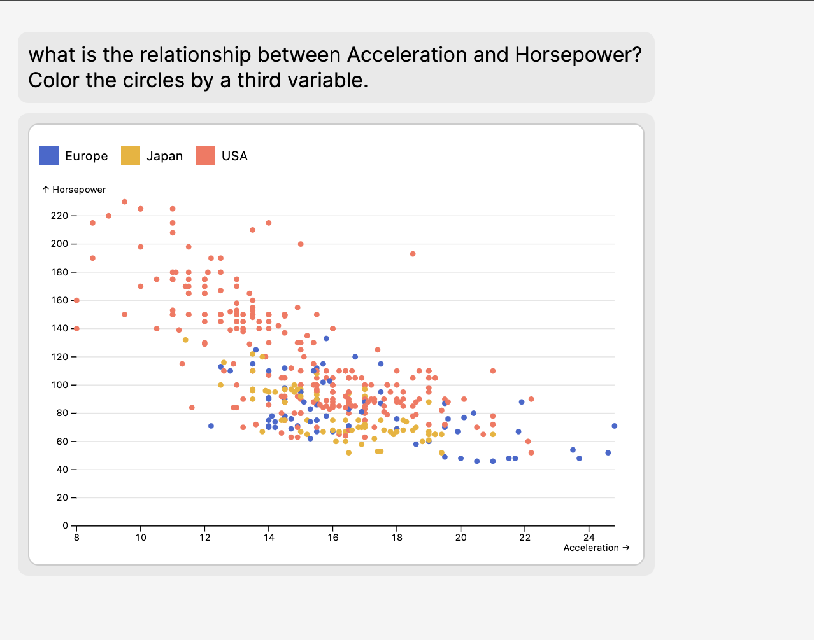

This is a generative AI assistant for helping you understand a new dataset. You can upload a SQLite database and chat with it. Here are some things it can do:

- Make basic charts
- Give you summary statistics based on free-form prompts
- Give you general descriptions of the dataset

It uses Vercel's AI SDK 3.0 for generative UI components, a sqlite database for storage, and Observable Plot to render the charts.



### Try out the following prompts

- do cars in different countries have different weights on average?
- what is the average weight of cars in Japan, in each year?
- what is the average horsepower each year for cars in each country? make a line chart with different color line for each country

## Running locally

I'm working on turning this into a functional web app, but you can currently run it locally to chat with your data.

There are a few sample datasets you can choose from in the main menu. You can also add your own. For now, it should just have one table, as the main goal of this tool is generating charts from a single dataset.

To upload your own data:

- drop a sqlite DB file in the `exampleData` folder at the root of the project.
- add your schema under the table name into `src/app/dataConfig.ts`
- edit the `options` array in the config to add your dataset to the select menu.
- Add your OpenAI apiKey in a new file named `.env.local` at the root.

Then, run the development server:

```bash
pnpm dev
```

Open [http://localhost:3000](http://localhost:3000) to run the app.
