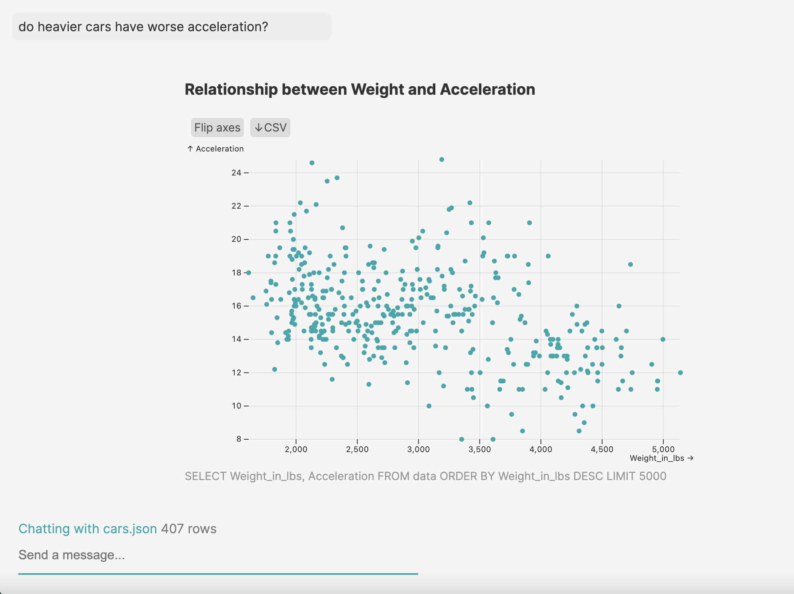

This is a generative AI assistant for helping you understand a new dataset. You can upload a JSON or CSV file and chat with it. Here are some things it can do:

- Make basic charts
- Give you summary statistics based on free-form prompts
- Give you general descriptions of the dataset

It uses Vercel's AI SDK 3.0 for generative UI components, a sqlite database for storage, and Observable Plot to render the charts. Your file will be loaded into an in-memory sqlite3 DB for querying using text-to-SQL AI queries.



### Try out the following prompts

- do cars in different countries have different weights on average?
- what is the average weight of cars in Japan, in each year?
- what is the average horsepower each year for cars in each country? make a line chart with different color line for each country

## Running locally

You can currently run this locally to chat with your data.

There are a few sample datasets you can choose from in the `exampleData` folder. You can also add your own by uploading a JSON or csv file. It will be erased when you close the tab or refresh the page.

Make sure to add your OpenAI apiKey in a new file named `.env.local` at the root.

Then, run the development server:

```bash
pnpm dev
```

This is an experimental solo project, so if you encounter errors feel free to open a PR or drop me a note.

Open [http://localhost:3000](http://localhost:3000) to run the app.
